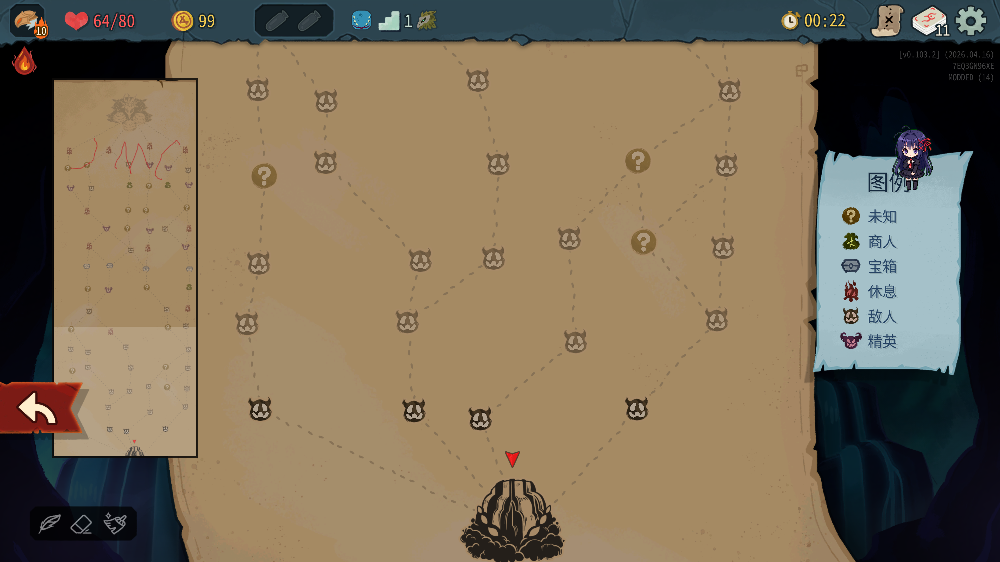
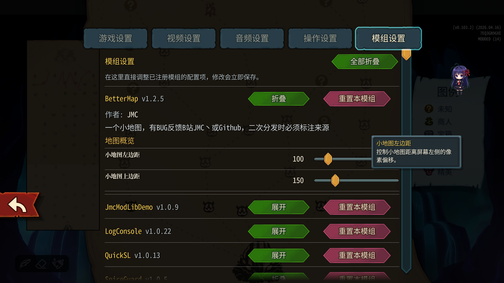

**🌐[ 中文 | [English](README_en.md) ]**

[📝更新日志](CHANGELOG.md)

[📦 Releases](https://github.com/JMC2002/SlayTheSpire2-BetterMap/releases)

# 更好的地图
##  0. 安装

### Mod本体安装
Steam版本直接在创意工坊订阅即可（暂未开放）

其他版本可以自行编译，或者在[📦 Releases](https://github.com/JMC2002/SlayTheSpire2-BetterMap/releases)界面下载.zip后解压到游戏安装目录下的Mods
目录下（没有就新建一个）

### 前置安装
**此外，本模组强依赖于模组[JmcModLib](https://github.com/JMC2002/JmcModLib_STS2/releases)**，安装方法同上

安装完成后的目录结构如下：

```sh
-- Slay the Spire 2
    |-- SlayTheSpire2.exe
        |-- mods
             |-- JmcModLib
             |-- BetterMap
                  |-- BetterMap.dll
                  |-- BetterMap.pck
                  |-- BetterMap.json
```

### 存档迁移
> 当你第一次安装MOD，游戏会默认将开启Mod的存档与没开启的隔离，可以按下面的方法迁移存档：

在安装好MOD后第一次打开游戏会询问是否启用MOD，启用并再次打开游戏一次后，退出游戏，将`%appdata%\SlayTheSpire2\steam\`下面的数字文件夹下的你对应的存档文件粘贴到该文件夹的`modded`文件夹中，以同步使用MOD前后的存档

---
## 🧠 1. 简介
在地图界面的左侧放置一个小地图，用于显示整个地图的全览

[演示视频（B站）](https://www.bilibili.com/video/BV14ScUzTEo2)

[Github仓库](https://github.com/JMC2002/SlayTheSpire2-BetterMap)
## ⚙️ 2. 功能
- 在地图界面显示全览小地图


- 设置界面可以调整小地图的位置

 
## 🔔 3. 提醒
- **本模组强依赖于模组[JmcModLib](https://github.com/JMC2002/JmcModLib_STS2/releases)**
 
## 🧩 4. 兼容性
- 由于游戏处于EA阶段，可能会随着游戏版本更新而失效

## 🧭 5. TODO
- ~~增加设置功能~~
- 增加一些小功能

**如果你喜欢这个 Mod 的话，希望可以点一个star~**

如果你真的很有钱，可以考虑给我赞助，给我赞助你得不到任何东西，但是可以吓我一跳。


